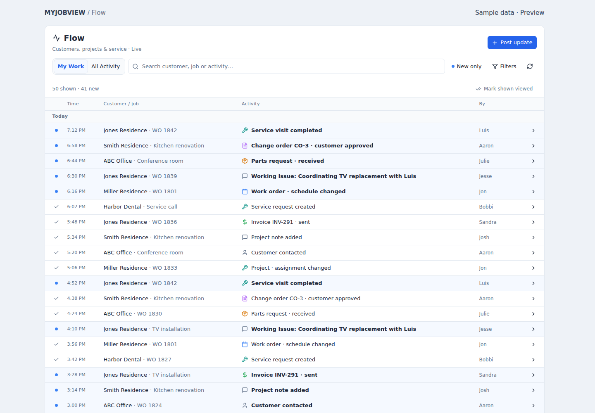
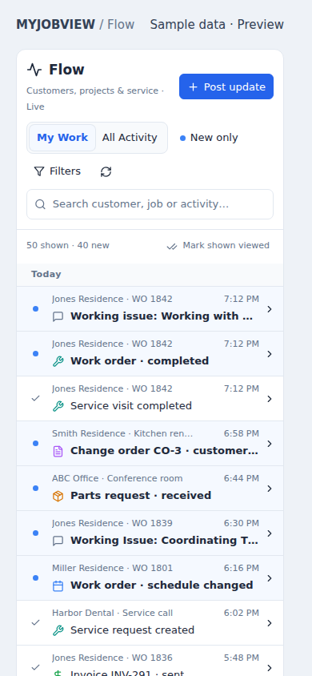

# Customer and job Flow — first release

Flow is the default view of the existing Feed module. Discussions remain in its second tab. Customer, Project, and Work Order detail screens each have a Flow tab backed by the same events and personal read state.

## Included

- Compact desktop rows, a two-line mobile layout, hover summaries, expandable details and record links.
- My Work / All Activity, text search, New only, customer/job picker, office, actor, activity category, dates, and customer location filters.
- 50 events per page with stable ID pagination. Realtime signals and 30-second reconciliation show a new-activity button instead of rearranging the list while someone reads.
- Individual viewed/new controls and **Mark shown viewed**, which marks exactly the loaded rows. Opening a detail marks the event viewed; loading or hovering does not. Viewing an event inside any scope also marks it viewed in the other scopes for that employee.
- A short Post update form with working issue, customer contact, material/scheduling issue, resolved, and general update types. Inside a customer/job, its context is preselected.
- Database capture of meaningful changes to work orders, projects, service requests, change orders, product requests, proposals, invoices, contacts; insert events for payments, project notes, customer contact logs, and manual Flow updates. Multiple relevant fields changed in one row update produce one event.
- Source module permissions, explicit user revokes, tenant isolation, restricted project-note visibility, and immutable system event rows. Actor identity is taken from the authenticated session, not client-supplied names.

## Release sequence

1. Apply `supabase/migrations/20260923224946_customer_job_flow.sql` to the same database used by the frontend.
2. Deploy the frontend from this branch. The migration also labels the existing `feed` navigation module **Flow**, preserving its existing grants and module ID.
3. With two employee accounts, open the same work order: post an update, open the entry, verify only the reader's status changes, and verify the other account sees a new-activity button.

The migration is additive apart from the navigation label. It attaches synchronous event triggers, so event insertion and the underlying business change commit or roll back together. Review and apply it before shipping the frontend; a frontend-only deployment cannot query the new RPCs.

No production migration was applied while preparing this change. No production records were modified for tests. There is no synthetic historical backfill: new activity begins when the migration is applied.

## Verification

- `npm ci`
- `npm run test:flow` — PostgreSQL/PGlite tests of each event producer, standalone service work, customer/project/work-order scopes, personal viewed state, My Work, pagination, transaction rollback, event forgery prevention, employee/tenant restrictions, module revokes (including duplicate module keys), restricted notes, and target search.
- `npm run build` — production build.
- Baseline/current `npm run typecheck`, with an increased Node heap, had the same 1,593 existing diagnostics and no new diagnostics. The repository's full typecheck is not currently green.
- Browser checks with synthetic records exercised a 50-row list, 37px desktop row height, details, read controls, filtering, buffered incoming activity, pagination, posting, mobile width, and dark styling. These are component checks with a mocked transport; live Supabase Realtime delivery still needs the post-deployment smoke check above.

## Deliberate first-release boundaries

- Existing notification delivery is unchanged; switching it off does not remove Flow activity. This release does not yet generate new alerts from Flow.
- Photos, file attachments, @mentions, replies, purchase-order line receiving, inventory usage, and technician time/photo batching are not emitted by this first release. Existing source screens remain available.
- Financial events show lifecycle changes without amounts. Opening the source record uses existing permissions.
- Project-note bodies are not copied into permanent events; the source note keeps control of its current content. Manual Flow updates are employee-visible and immutable.
- Current project/customer/work-order assignments determine My Work. Event labels preserve their historical snapshot.

## Visual previews

Synthetic sample data, not live customer records.

